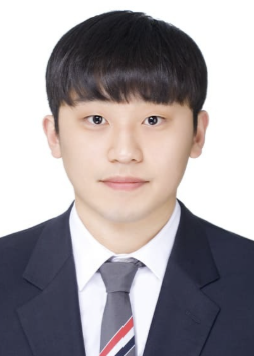
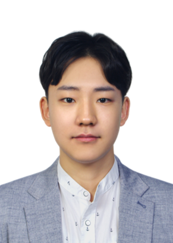
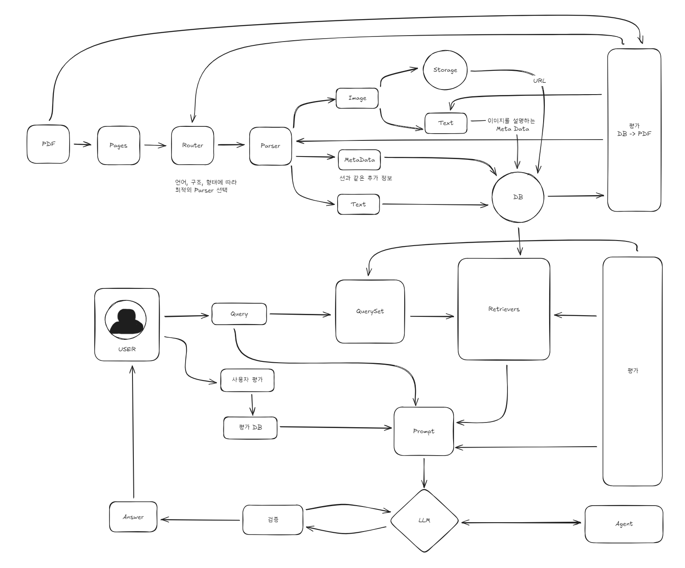

# 자율 프로젝트 대전 2반(기업연계 S3) 7조

### 삼성전자 생산기술연구소 연계 프로젝트 (RAG, 챗봇)

## 팀 소개 (Team.PromTree)

  <table>
    <tr>
      <td height="140px" align="center">
        <a href="https://github.com/jeonhaejidev">
            
          전해지  
          (Team-Leader)
        </a>
         
      </td>
      <td height="140px" align="center">
        <a href="https://github.com/yang-yang140">
            
          양현지  
          (ChatBot)
        </a>
         
      </td>
      <td height="140px" align="center">
        <a href="https://github.com/Yoo-SeungHyeon">
            
          유승현  
          (Parser)
        </a>
         
      </td>
      <td height="140px" align="center">
        <a href="https://github.com/hitoriudon">
            
          이석철  
          (Parser)
        </a>
         
      </td>
      <td height="140px" align="center">
        <a href="https://github.com/eunkyeongCho">
            
          조은경  
          (Parser)
        </a>
         
      </td>
      <td height="140px" align="center">
        <a href="https://github.com/InHyuk-Choi">
            
          최인혁  
          (ChatBot)
        </a>
         
      </td>
    </tr>
    <tr>
      <td align="center" style="text-align:center;">
        Python 
        LangChain 
        PyPlumber 
        PyEnv 
        Venv 
        Streamlit 
      </td>
      <td align="center" style="text-align:center;">
        Python 
        LangChain 
        PyPlumber 
        PyEnv 
        Venv 
        Streamlit 
      </td>
      <td align="center" style="text-align:center;">
        Python 
        LangChain 
        PyPlumber 
        PyEnv 
        Venv 
        Streamlit 
      </td>
      <td align="center" style="text-align:center;">
        Python 
        LangChain 
        PyPlumber 
        PyEnv 
        Venv 
        Streamlit 
      </td>
      <td align="center" style="text-align:center;">
        Python 
        LangChain 
        PyPlumber 
        PyEnv 
        Venv 
        Streamlit 
      </td>
      <td align="center" style="text-align:center;">
        Python 
        LangChain 
        PyPlumber 
        PyEnv 
        Venv 
        Streamlit 
      </td>
    </tr>
  </table>

 

## 프로젝트 기간

**2025-10-10 ~ 2025-11-20 (6주)**

## 프로젝트 소개
여러 소재들을 혼합하였을 때 어떤 물성이 나오는지 예측하려고 함. 이때 사내에 쌓인 소재 물성 pdf 파일들에 대하여 DB화 할 수 있는 코드/프로그램이 필요함. DB화된 정보를 바탕으로 *예측 모델을 제작하고 챗봇 형태로 질의 응답을 할 수 있도록 하려고 함.

## 프로젝트 요구사항

### 필수 구현기능
- pdf 파일 내에 있는 소재 물성 정보 추출(정확도 99% 이상)
- 다수의 pdf 파일에서 추출한 물성 정보들 DB화
- LLM UI 사이트 제작(Open Webui, Streamlit 등 활용 가능)
- 해당 UI에서 소재 물성 예측 모델 연동(LLM agent)
- 해당 UI에서 RAG 기능 활용하여 DB에 있는 데이터 관련 질의 연동

### 추가 구현기능
- 소재 물성 예측 모델 간단하게 제작(사내 예측 모델 대외비)
- 사이트에 여러 명이 동시 사용할 수 있도록 LLM 서버 구축

## 프로젝트 개발 요소

### 요구 기술 스택
- **Langchain**: RAG 프레임워크
- **Streamlit, Open Webui**: 웹 기반 UI 개발 프레임워크
- **MongoDB or PostgreSQL**: 데이터를 관리하기 위한 DB(기업 사용이 가능한 무료 DB)

### 개발 언어
- Python

### 개발 환경
- Windows 10 or 11
- DB: MongoDB 또는 PostgreSQL

## 아키텍쳐

