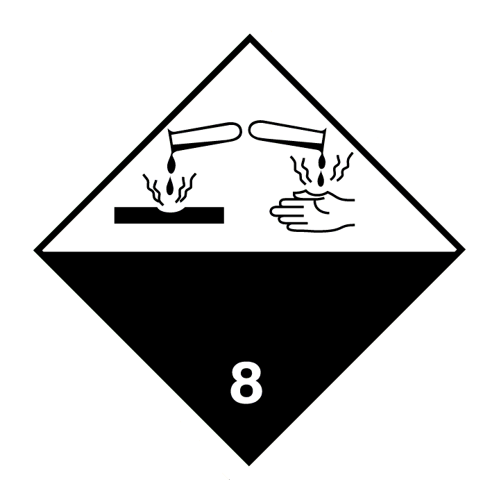

>>> page 1

Revision date: 29/07/2020
Revision: 5
Supersedes date: 28/07/2020

# SAFETY DATA SHEET
# HYDROCHLORIC ACID 1.18 S.G. LRG
### According to Regulation (EC) No 1907/2006, Annex II, as amended. Commission Regulation (EU) No 2015/830
### of 28 May 2015.
SECTION 1: Identification of the substance/mixture and of the company/undertaking
1.1. Product identifier
Product name
HYDROCHLORIC ACID 1.18 S.G. LRG
Product number
1206
REACH registration number
01-2119484862-27-XXXX
CAS number
7647-01-0
EU index number
017-002-01-X
EC number
231-595-7
1.2. Relevant identified uses of the substance or mixture and uses advised against
Identified uses
Cleaning agent. Laboratory reagent.
Uses advised against
No specific uses advised against are identified.
1.3. Details of the supplier of the safety data sheet
Supplier
Reagent Chemical Services
11b - 13 Aston Fields Road
Whitehouse Industrial Estate
Runcorn
Cheshire WA7 3DL
T: 01928 716903 (08.30 - 17.00)
F: 01928 716425
E: info@reagent.co.uk
1.4. Emergency telephone number
Emergency telephone
OHES Environmental Ltd 24-7
Tel. 0333 333 9939 (24 hour)
Notes
The product identification numbers refer to hydrogen chloride.
SECTION 2: Hazards identification
2.1. Classification of the substance or mixture
Classification (EC 1272/2008)
Physical hazards
Met. Corr. 1 - H290
Health hazards
Skin Corr. 1B - H314 Eye Dam. 1 - H318 STOT SE 3 - H335
Environmental hazards
Not Classified
Classification (67/548/EEC or
1999/45/EC)
C;R34. Xi;R37.
2.2. Label elements
1/15

>>> pend

>>> page 2

Revision date: 29/07/2020
Revision: 5
Supersedes date: 28/07/2020
# HYDROCHLORIC ACID 1.18 S.G. LRG
EC number
231-595-7
Hazard pictograms

Signal word
Danger
Hazard statements
H290 May be corrosive to metals.
H314 Causes severe skin burns and eye damage.
H335 May cause respiratory irritation.
Precautionary statements
P260 Do not breathe vapour/ spray.
P271 Use only outdoors or in a well-ventilated area.
P280 Wear protective gloves/ protective clothing/ eye protection/ face protection.
P305+P351+P338 IF IN EYES: Rinse cautiously with water for several minutes. Remove
contact lenses, if present and easy to do. Continue rinsing.
P310 Immediately call a POISON CENTER/ doctor.
P501 Dispose of contents/ container in accordance with local regulations.
Contains
HYDROCHLORIC ACID 36 %
Supplementary precautionary
statements
P234 Keep only in original packaging.
P261 Avoid breathing vapour/ spray.
P264 Wash contaminated skin thoroughly after handling.
P301+P330+P331 IF SWALLOWED: Rinse mouth. Do NOT induce vomiting.
P303+P361+P353 IF ON SKIN (or hair): Take off immediately all contaminated clothing.
Rinse skin with water or shower.
P304+P340 IF INHALED: Remove person to fresh air and keep comfortable for breathing.
P312 Call a POISON CENTRE/doctor if you feel unwell.
P321 Specific treatment (see medical advice on this label).
P363 Wash contaminated clothing before reuse.
P390 Absorb spillage to prevent material damage.
P403+P233 Store in a well-ventilated place. Keep container tightly closed.
P405 Store locked up.
P406 Store in a corrosion-resistant/… container with a resistant inner liner.
2.3. Other hazards
This product does not contain any substances classified as PBT or vPvB.
SECTION 3: Composition/information on ingredients
3.2. Mixtures

| HYDROCHLORIC ACID ...% 10-30% CAS number: 7647-01-0 EC number: 231-595-7 REACH registration number: 01- 2119484862-27-0000 |
| --- |
| Classification Met. Corr. 1 - H290 Skin Corr. 1B - H314 Eye Dam. 1 - H318 STOT SE 3 - H335 |

HYDROCHLORIC ACID ...%
10-30%
CAS number: 7647-01-0
EC number: 231-595-7
REACH registration number: 01-
2119484862-27-0000
Classification
Met. Corr. 1 - H290
Skin Corr. 1B - H314
Eye Dam. 1 - H318
STOT SE 3 - H335
The Full Text for all R-Phrases and Hazard Statements are Displayed in Section 16.
Composition comments
An aqueous solution of hydrochloric acid.
2/15

>>> pend

>>> page 3

Revision date: 29/07/2020
Revision: 5
Supersedes date: 28/07/2020
# HYDROCHLORIC ACID 1.18 S.G. LRG
SECTION 4: First aid measures
4.1. Description of first aid measures
General information
Get medical attention immediately. Show this Safety Data Sheet to the medical personnel.
Chemical burns must be treated by a physician.
Inhalation
Remove affected person from source of contamination. Move affected person to fresh air and
keep warm and at rest in a position comfortable for breathing. Maintain an open airway.
Loosen tight clothing such as collar, tie or belt. When breathing is difficult, properly trained
personnel may assist affected person by administering oxygen. Place unconscious person on
their side in the recovery position and ensure breathing can take place.
Ingestion
Rinse mouth thoroughly with water. Remove any dentures. Stop if the affected person feels
sick as vomiting may be dangerous. Do not induce vomiting unless under the direction of
medical personnel. If vomiting occurs, the head should be kept low so that vomit does not
enter the lungs. Never give anything by mouth to an unconscious person. Move affected
person to fresh air and keep warm and at rest in a position comfortable for breathing. Place
unconscious person on their side in the recovery position and ensure breathing can take
place. Maintain an open airway. Loosen tight clothing such as collar, tie or belt.
Skin contact
It is important to remove the substance from the skin immediately. Take off immediately all
contaminated clothing. Rinse immediately with plenty of water. Continue to rinse for at least
15 minutes and get medical attention. Chemical burns must be treated by a physician.
Eye contact
Rinse immediately with plenty of water. Remove contact lenses, if present and easy to do.
Continue rinsing. Continue to rinse for at least 10 minutes.
Protection of first aiders
First aid personnel should wear appropriate protective equipment during any rescue. If it is
suspected that volatile contaminants are still present around the affected person, first aid
personnel should wear an appropriate respirator or self-contained breathing apparatus. Wash
contaminated clothing thoroughly with water before removing it from the affected person, or
wear gloves. It may be dangerous for first aid personnel to carry out mouth-to-mouth
resuscitation.
4.2. Most important symptoms and effects, both acute and delayed
General information
See Section 11 for additional information on health hazards. The severity of the symptoms
described will vary dependent on the concentration and the length of exposure.
Inhalation
A single exposure may cause the following adverse effects: Severe irritation of nose and
throat. Symptoms following overexposure may include the following: Corrosive to the
respiratory tract.
Ingestion
May cause chemical burns in mouth, oesophagus and stomach. Symptoms following
overexposure may include the following: Severe stomach pain. Nausea, vomiting.
Skin contact
Causes severe burns. Symptoms following overexposure may include the following: Pain or
irritation. Redness. Blistering may occur.
Eye contact
Causes serious eye damage. Symptoms following overexposure may include the following:
Pain. Profuse watering of the eyes. Redness.
4.3. Indication of any immediate medical attention and special treatment needed
Notes for the doctor
Treat symptomatically.
SECTION 5: Firefighting measures
5.1. Extinguishing media
Suitable extinguishing media
The product is not flammable. Extinguish with alcohol-resistant foam, carbon dioxide, dry
powder or water fog. Use fire-extinguishing media suitable for the surrounding fire.
3/15

>>> pend

>>> page 4

Revision date: 29/07/2020
Revision: 5
Supersedes date: 28/07/2020
# HYDROCHLORIC ACID 1.18 S.G. LRG
Unsuitable extinguishing
media
Do not use water jet as an extinguisher, as this will spread the fire.
5.2. Special hazards arising from the substance or mixture
Specific hazards
Containers can burst violently or explode when heated, due to excessive pressure build-up.
Severe corrosive hazard. Water used for fire extinguishing, which has been in contact with the
product, may be corrosive.
Hazardous combustion
products
Thermal decomposition or combustion products may include the following substances: Very
toxic or corrosive gases or vapours. Hydrogen chloride (HCl).
5.3. Advice for firefighters
Protective actions during
firefighting
Avoid breathing fire gases or vapours. Evacuate area. Keep upwind to avoid inhalation of
gases, vapours, fumes and smoke. Ventilate closed spaces before entering them. Cool
containers exposed to heat with water spray and remove them from the fire  area if it can be
done without risk. Cool containers exposed to flames with water until well after the fire is out.
If a leak or spill has not ignited, use water spray to disperse vapours and protect men stopping
the leak. Avoid discharge to the aquatic environment. Control run-off water by containing and
keeping it out of sewers and watercourses. If risk of water pollution occurs, notify appropriate
authorities.
Special protective equipment
for firefighters
Regular protection may not be safe. Wear chemical protective suit. Wear positive-pressure
self-contained breathing apparatus (SCBA) and appropriate protective clothing. Firefighter's
clothing conforming to European standard EN469 (including helmets, protective boots and
gloves) will provide a basic level of protection for chemical incidents.
SECTION 6: Accidental release measures
6.1. Personal precautions, protective equipment and emergency procedures
Personal precautions
No action shall be taken without appropriate training or involving any personal risk. Keep
unnecessary and unprotected personnel away from the spillage. Wear protective clothing as
described in Section 8 of this safety data sheet. Follow precautions for safe handling
described in this safety data sheet. Wash thoroughly after dealing with a spillage. Ensure
procedures and training for emergency decontamination and disposal are in place. Do not
touch or walk into spilled material. Provide adequate ventilation. Avoid inhalation of vapours
and spray/mists. Use suitable respiratory protection if ventilation is inadequate. Avoid contact
with skin and eyes. Avoid contact with contaminated tools and objects.
6.2. Environmental precautions
Environmental precautions
The product may affect the acidity (pH) of water which may have hazardous effects on aquatic
organisms. Avoid discharge to the aquatic environment. Large Spillages: Inform the relevant
authorities if environmental pollution occurs (sewers, waterways, soil or air).
6.3. Methods and material for containment and cleaning up
4/15

>>> pend

>>> page 5

Revision date: 29/07/2020
Revision: 5
Supersedes date: 28/07/2020
# HYDROCHLORIC ACID 1.18 S.G. LRG
Methods for cleaning up
Wear protective clothing as described in Section 8 of this safety data sheet. Clear up spills
immediately and dispose of waste safely. This product is corrosive. Approach the spillage
from upwind. Small Spillages: If the product is soluble in water, dilute the spillage with water
and mop it up. Alternatively, or if it is not water-soluble, absorb the spillage with an inert, dry
material and place it in a suitable waste disposal container. Large Spillages: If leakage cannot
be stopped, evacuate area. Flush spilled material into an effluent treatment plant, or proceed
as follows. Contain and absorb spillage with sand, earth or other non-combustible material.
Place waste in labelled, sealed containers. Clean contaminated objects and areas thoroughly,
observing environmental regulations. The contaminated absorbent may pose the same
hazard as the spilled material. Flush contaminated area with plenty of water. Wash thoroughly
after dealing with a spillage. The requirements of the local water authority must be complied
with if contaminated water is flushed directly to the sewer. Dispose of waste to licensed waste
disposal site in accordance with the requirements of the local Waste Disposal Authority.
6.4. Reference to other sections
Reference to other sections
For personal protection, see Section 8. See Section 11 for additional information on health
hazards. See Section 12 for additional information on ecological hazards. For waste disposal,
see Section 13.
SECTION 7: Handling and storage
7.1. Precautions for safe handling
Usage precautions
Read and follow manufacturer's recommendations. Wear protective clothing as described in
Section 8 of this safety data sheet. Keep away from food, drink and animal feeding stuffs.
Handle all packages and containers carefully to minimise spills. Keep container tightly sealed
when not in use. Avoid the formation of mists. This product is corrosive. Immediate first aid is
imperative. Do not handle until all safety precautions have been read and understood. Do not
handle broken packages without protective equipment. Do not reuse empty containers.
Advice on general
occupational hygiene
Wash promptly if skin becomes contaminated. Take off contaminated clothing. Wash
contaminated clothing before reuse. Do not eat, drink or smoke when using this product.
Wash at the end of each work shift and before eating, smoking and using the toilet. Change
work clothing daily before leaving workplace.
7.2. Conditions for safe storage, including any incompatibilities
Storage precautions
Store away from incompatible materials (see Section 10). Store in accordance with local
regulations. Store away from the following materials: Alkalis. Keep only in the original
container. Keep container tightly closed, in a cool, well ventilated place. Keep containers
upright. Protect containers from damage. Bund storage facilities to prevent soil and water
pollution in the event of spillage. The storage area floor should be leak-tight, jointless and not
absorbent.
Storage class
Corrosive storage.
7.3. Specific end use(s)
Specific end use(s)
The identified uses for this product are detailed in Section 1.2.
SECTION 8: Exposure controls/Personal protection
8.1. Control parameters
Occupational exposure limits
HYDROCHLORIC ACID ...%
Long-term exposure limit (8-hour TWA): WEL 1 ppm 2 mg/m³ gas and aerosol mists
Short-term exposure limit (15-minute): WEL 5 ppm 8 mg/m³ gas and aerosol mists
WEL = Workplace Exposure Limit.
5/15

>>> pend

>>> page 6

Revision date: 29/07/2020
Revision: 5
Supersedes date: 28/07/2020
# HYDROCHLORIC ACID 1.18 S.G. LRG
DNEL
Workers - Inhalation; Long term local effects: 8 mg/m³
Workers - Inhalation; Short term local effects: 15 mg/m³
General population - Inhalation; Long term local effects: 8 mg/m³
General population - Inhalation; Short term local effects: 15 mg/m³
HYDROCHLORIC ACID ...% (CAS: 7647-01-0)
DNEL
Workers - Inhalation; Long term local effects: 8 mg/m³
Workers - Inhalation; Short term local effects: 15 mg/m³
General population - Inhalation; Long term local effects: 8 mg/m³
General population - Inhalation; Short term local effects: 15 mg/m³
8.2. Exposure controls
Protective equipment

Appropriate engineering
controls
Provide adequate ventilation. Personal, workplace environment or biological monitoring may
be required to determine the effectiveness of the ventilation or other control measures and/or
the necessity to use respiratory protective equipment. Use process enclosures, local exhaust
ventilation or other engineering controls as the primary means to minimise worker exposure.
Personal protective equipment should only be used if worker exposure cannot be controlled
adequately by the engineering control measures. Ensure control measures are regularly
inspected and maintained. Ensure operatives are trained to minimise exposure.
Eye/face protection
Eyewear complying with an approved standard should be worn if a risk assessment indicates
eye contact is possible. Personal protective equipment for eye and face protection should
comply with European Standard EN166. Wear tight-fitting, chemical splash goggles or face
shield. If inhalation hazards exist, a full-face respirator may be required instead.
Hand protection
Chemical-resistant, impervious gloves complying with an approved standard should be worn if
a risk assessment indicates skin contact is possible. To protect hands from chemicals, gloves
should comply with European Standard EN374. Considering the data specified by the glove
manufacturer, check during use that the gloves are retaining their protective properties and
change them as soon as any deterioration is detected. Frequent changes are recommended.
It is recommended that gloves are made of the following material: Nitrile rubber. Butyl rubber.
Polyvinyl chloride (PVC). Viton rubber (fluoro rubber). The selected gloves should have a
breakthrough time of at least 8 hours. Protective gloves should have a minimum thickness of
0.4 mm. The most suitable glove should be chosen in consultation with the glove
supplier/manufacturer, who can provide information about the breakthrough time of the glove
material.
Other skin and body
protection
Appropriate footwear and additional protective clothing complying with an approved standard
should be worn if a risk assessment indicates skin contamination is possible.
Hygiene measures
Provide eyewash station and safety shower. Contaminated work clothing should not be
allowed out of the workplace. Wash contaminated clothing before reuse. Clean equipment
and the work area every day. Good personal hygiene procedures should be implemented.
Wash at the end of each work shift and before eating, smoking and using the toilet. When
using do not eat, drink or smoke. Preventive industrial medical examinations should be carried
out. Warn cleaning personnel of any hazardous properties of the product.
6/15

>>> pend

>>> page 7

Revision date: 29/07/2020
Revision: 5
Supersedes date: 28/07/2020
# HYDROCHLORIC ACID 1.18 S.G. LRG
Respiratory protection
Respiratory protection complying with an approved standard should be worn if a risk
assessment indicates inhalation of contaminants is possible. Ensure all respiratory protective
equipment is suitable for its intended use and is ‘CE’-marked. Check that the respirator fits
tightly and the filter is changed regularly. Gas and combination filter cartridges should comply
with European Standard EN14387. Full face mask respirators with replaceable filter cartridges
should comply with European Standard EN136. Half mask and quarter mask respirators with
replaceable filter cartridges should comply with European Standard EN140. Consult with the
supplier as to the compatibility of the equipment with the chemical of concern.
Environmental exposure
controls
Keep container tightly sealed when not in use. Emissions from ventilation or work process
equipment should be checked to ensure they comply with the requirements of environmental
protection legislation. In some cases, fume scrubbers, filters or engineering modifications to
the process equipment will be necessary to reduce emissions to acceptable levels. Store in a
demarcated bunded area to prevent release to drains and/or watercourses.
SECTION 9: Physical and chemical properties
9.1. Information on basic physical and chemical properties
Appearance
Liquid.
Colour
Colourless.
Odour
Pungent.
pH
pH (concentrated solution): <1
Melting point
Not determined.
Initial boiling point and range
Not determined.
Flash point
Not relevant.
Evaporation rate
Not determined.
Evaporation factor
Not determined.
Flammability (solid, gas)
No.
Upper/lower flammability or
explosive limits
Not relevant.
Vapour pressure
Not determined.
Vapour density
Not determined.
Relative density
Approx. 1.18 @ @ 20°C
Bulk density
Not relevant.
Solubility(ies)
Not determined. Miscible with water.
Partition coefficient
Not applicable. REACH dossier information.
Auto-ignition temperature
Not relevant.
Decomposition Temperature
Not determined.
Viscosity
Not determined.
Explosive properties
Not considered to be explosive.
Explosive under the influence
of a flame
No
Oxidising properties
Does not meet the criteria for classification as oxidising.
7/15

>>> pend

>>> page 8

Revision date: 29/07/2020
Revision: 5
Supersedes date: 28/07/2020
# HYDROCHLORIC ACID 1.18 S.G. LRG
9.2. Other information
Refractive index
Not determined.
Particle size
Not relevant.
Molecular weight
Not relevant.
Volatility
Not determined.
Saturation concentration
Not determined.
Critical temperature
Not relevant.
Volatile organic compound
Not relevant.
SECTION 10: Stability and reactivity
10.1. Reactivity
Reactivity
The following materials may react with the product: Alkalis. Inorganic sulphides. Organic
sulphur compounds. Oxidising agents. Inorganic cyanides. Organic cyanides (nitriles).
10.2. Chemical stability
Stability
Stable at normal ambient temperatures and when used as recommended. Stable under the
prescribed storage conditions.
10.3. Possibility of hazardous reactions
Possibility of hazardous
reactions
May generate heat. In contact with some metals can generate hydrogen gas, which can form
explosive mixtures with air. Reactions can occur with incompatible materials to produce toxic
or corrosive gases. May produce hydrogen cyanide or hydrogen sulphide.
10.4. Conditions to avoid
Conditions to avoid
Avoid heat. Containers can burst violently or explode when heated, due to excessive pressure
build-up.
10.5. Incompatible materials
Materials to avoid
Alkalis. Amines. Mild steel. Stainless steel. Aluminium. May be corrosive to metals. Oxidising
agents. Inorganic sulphides. Organic sulphur compounds. Inorganic cyanides. Organic
cyanides (nitriles).
10.6. Hazardous decomposition products
Hazardous decomposition
products
Does not decompose when used and stored as recommended.
SECTION 11: Toxicological information
11.1. Information on toxicological effects
Acute toxicity - oral
Notes (oral LD₅₀)
Based on available data the classification criteria are not met.
Acute toxicity - dermal
Notes (dermal LD₅₀)
Based on available data the classification criteria are not met.
Acute toxicity - inhalation
Acute toxicity inhalation (LC₅₀
vapours mg/l)
8.3
Notes (inhalation LC₅₀)
Based on available data the classification criteria are not met.
Skin corrosion/irritation
8/15

>>> pend

>>> page 9

Revision date: 29/07/2020
Revision: 5
Supersedes date: 28/07/2020
# HYDROCHLORIC ACID 1.18 S.G. LRG
Animal data
Skin Corr. 1B - H314 Causes severe burns.
Extreme pH
≤ 2 Corrosive.
Serious eye damage/irritation
Serious eye damage/irritation
Eye Dam. 1 - H318 Corrosive to skin. Corrosivity to eyes is assumed.
Respiratory sensitisation
Respiratory sensitisation
Based on available data the classification criteria are not met.
Skin sensitisation
Skin sensitisation
Based on available data the classification criteria are not met.
Germ cell mutagenicity
Genotoxicity - in vitro
Based on available data the classification criteria are not met.
Genotoxicity - in vivo
Scientifically unjustified.
Carcinogenicity
Carcinogenicity
Based on available data the classification criteria are not met. NOAEL <10 ppm, Inhalation,
Rat
IARC carcinogenicity
None of the ingredients are listed or exempt.
Reproductive toxicity
Reproductive toxicity - fertility
Based on available data the classification criteria are not met.
Reproductive toxicity -
development
Based on available data the classification criteria are not met.
Specific target organ toxicity - single exposure
STOT - single exposure
STOT SE 3 - H335 May cause respiratory irritation.
Target organs
Respiratory system, lungs
Specific target organ toxicity - repeated exposure
STOT - repeated exposure
Not classified as a specific target organ toxicant after repeated exposure. NOAEL 20 ppm,
Inhalation, Rat 13 weeks
Target organs
Respiratory system, lungs
Aspiration hazard
Aspiration hazard
Based on available data the classification criteria are not met.
General information
The severity of the symptoms described will vary dependent on the concentration and the
length of exposure.
Inhalation
Corrosive to the respiratory tract. Symptoms following overexposure may include the
following: Severe irritation of nose and throat.
Ingestion
May cause chemical burns in mouth, oesophagus and stomach. Symptoms following
overexposure may include the following: Severe stomach pain. Nausea, vomiting.
Skin contact
Causes severe burns. Symptoms following overexposure may include the following: Pain or
irritation. Redness. Blistering may occur.
Eye contact
Causes serious eye damage. Symptoms following overexposure may include the following:
Pain. Profuse watering of the eyes. Redness.
Route of exposure
Ingestion Inhalation Skin and/or eye contact
9/15

>>> pend

>>> page 10

Revision date: 29/07/2020
Revision: 5
Supersedes date: 28/07/2020
# HYDROCHLORIC ACID 1.18 S.G. LRG
Target organs
Respiratory system, lungs
Toxicological information on ingredients.
HYDROCHLORIC ACID ...%
Toxicological effects
The toxicity of this substance has been assessed during REACH registration.
Acute toxicity - oral
Notes (oral LD₅₀)
Scientifically unjustified. REACH dossier information.
Acute toxicity - dermal
Notes (dermal LD₅₀)
Scientifically unjustified. REACH dossier information.
Acute toxicity - inhalation
Acute toxicity inhalation
(LC₅₀ dust/mist mg/l)
8.3
Species
Rat
Notes (inhalation LC₅₀)
REACH dossier information. LC50 8.3 mg/l, 30 minutes, Dust/Mist Rat
Skin corrosion/irritation
Animal data
Corrosive to skin. REACH dossier information.
Serious eye damage/irritation
Serious eye
damage/irritation
Causes serious eye damage. REACH dossier information.
Respiratory sensitisation
Respiratory sensitisation
Scientifically unjustified.
Skin sensitisation
Skin sensitisation
Not sensitising. REACH dossier information.
Germ cell mutagenicity
Genotoxicity - in vitro
Negative. REACH dossier information.
Genotoxicity - in vivo
No specific test data are available. REACH dossier information.
Carcinogenicity
Carcinogenicity
NOAEL <10 ppm, Inhalation, Rat Based on available data the classification criteria
are not met.
Reproductive toxicity
Reproductive toxicity -
fertility
Scientifically unjustified. REACH dossier information.
Reproductive toxicity -
development
This substance has no evidence of toxicity to reproduction.
Specific target organ toxicity - single exposure
STOT - single exposure
No specific test data are available.
Specific target organ toxicity - repeated exposure
STOT - repeated exposure NOAEL 20 ppm, Inhalation, Rat 13 weeks
Aspiration hazard
10/15

>>> pend

>>> page 11

Revision date: 29/07/2020
Revision: 5
Supersedes date: 28/07/2020
# HYDROCHLORIC ACID 1.18 S.G. LRG
Aspiration hazard
Not anticipated to present an aspiration hazard, based on chemical structure.
Inhalation
Irritating to respiratory system. Burns can occur.
Ingestion
Corrosive. Small amounts may cause serious damage.
Skin contact
Causes burns.
Eye contact
This product is strongly corrosive. Causes serious eye damage.
SECTION 12: Ecological information
Ecotoxicity
The product may affect the acidity (pH) of water which may have hazardous effects on aquatic
organisms.
Ecological information on ingredients.
HYDROCHLORIC ACID ...%
Ecotoxicity
The product may affect the acidity (pH) of water which may have hazardous effects
on aquatic organisms.
12.1. Toxicity
Toxicity
Based on available data the classification criteria are not met.
Ecological information on ingredients.
HYDROCHLORIC ACID ...%
Acute aquatic toxicity
Acute toxicity - fish
LC₅₀, 96 hours: pH 3.5 - 3.25 , Lepomis macrochirus (Bluegill)
Acute toxicity - aquatic
invertebrates
EC₅₀, 48 hours: pH 4.92 , Daphnia magna
Acute toxicity - aquatic
plants
EC₅₀, 72 hours: pH 4.7 , Freshwater algae
Acute toxicity -
microorganisms
EC₅₀, 3 hours: pH 5 - 5.5 , Activated sludge
Acute toxicity - terrestrial
Not available.
Chronic aquatic toxicity
Chronic toxicity - fish early
life stage
Not determined.
Short term toxicity -
embryo and sac fry stages
Not determined.
Chronic toxicity - aquatic
invertebrates
Scientifically unjustified.
12.2. Persistence and degradability
Persistence and degradability
The product contains inorganic substances which are not biodegradable.
Phototransformation
Not relevant.
Stability (hydrolysis)
Not relevant.
11/15

>>> pend

>>> page 12

Revision date: 29/07/2020
Revision: 5
Supersedes date: 28/07/2020
# HYDROCHLORIC ACID 1.18 S.G. LRG
Biodegradation
Scientifically unjustified.
Biological oxygen demand
Not relevant.
Chemical oxygen demand
Not relevant.
Ecological information on ingredients.
HYDROCHLORIC ACID ...%
Persistence and
degradability
The product is expected to be biodegradable.
Phototransformation
Not relevant.
Substance is inorganic.
Stability (hydrolysis)
Not relevant.
Biodegradation
Scientifically unjustified.
Biological oxygen demand
Not relevant.
Chemical oxygen demand
Not relevant.
12.3. Bioaccumulative potential
Bioaccumulative potential
Bioaccumulation is unlikely.
Partition coefficient
Not applicable. REACH dossier information.
Ecological information on ingredients.
HYDROCHLORIC ACID ...%
Bioaccumulative potential
The product is not bioaccumulating.
Partition coefficient
Scientifically unjustified.
12.4. Mobility in soil
Mobility
The product is water-soluble and may spread in water systems. Volatile liquid.
Adsorption/desorption
coefficient
Scientifically unjustified.
Henry's law constant
Not determined.
Surface tension
Not relevant. REACH dossier information.
Ecological information on ingredients.
HYDROCHLORIC ACID ...%
Mobility
The product is miscible with water and may spread in water systems.
Adsorption/desorption
coefficient
Scientifically unjustified.
Henry's law constant
Not determined.
Surface tension
Scientifically unjustified.
12.5. Results of PBT and vPvB assessment
Results of PBT and vPvB
assessment
This product does not contain any substances classified as PBT or vPvB.
12/15

>>> pend

>>> page 13

Revision date: 29/07/2020
Revision: 5
Supersedes date: 28/07/2020
# HYDROCHLORIC ACID 1.18 S.G. LRG
Ecological information on ingredients.
HYDROCHLORIC ACID ...%
Results of PBT and vPvB
assessment
This substance is not classified as PBT or vPvB according to current EU criteria.
12.6. Other adverse effects
Other adverse effects
None known.
Ecological information on ingredients.
HYDROCHLORIC ACID ...%
Other adverse effects
Not determined.
SECTION 13: Disposal considerations
13.1. Waste treatment methods
General information
The generation of waste should be minimised or avoided wherever possible. Reuse or recycle
products wherever possible. This material and its container must be disposed of in a safe
way. Disposal of this product, process solutions, residues and by-products should at all times
comply with the requirements of environmental protection and waste disposal legislation and
any local authority requirements. When handling waste, the safety precautions applying to
handling of the product should be considered. Care should be taken when handling emptied
containers that have not been thoroughly cleaned or rinsed out. Empty containers or liners
may retain some product residues and hence be potentially hazardous.
Disposal methods
Do not empty into drains. Dispose of surplus products and those that cannot be recycled via a
licensed waste disposal contractor. Waste, residues, empty containers, discarded work
clothes and contaminated cleaning materials should be collected in designated containers,
labelled with their contents. Incineration or landfill should only be considered when recycling is
not feasible.
SECTION 14: Transport information
General
For limited quantity packaging/limited load information, consult the relevant modal
documentation using the data shown in this section.
14.1. UN number
UN No. (ADR/RID)
1789
UN No. (IMDG)
1789
UN No. (ICAO)
1789
14.2. UN proper shipping name
Proper shipping name
(ADR/RID)
HYDROCHLORIC ACID
Proper shipping name (IMDG) HYDROCHLORIC ACID
Proper shipping name (ICAO)
HYDROCHLORIC ACID
Proper shipping name (ADN)
HYDROCHLORIC ACID
14.3. Transport hazard class(es)
ADR/RID class
8
ADR/RID label
8
13/15

>>> pend

>>> page 14

Revision date: 29/07/2020
Revision: 5
Supersedes date: 28/07/2020
# HYDROCHLORIC ACID 1.18 S.G. LRG
IMDG class
8
ICAO class/division
8
Transport labels

14.4. Packing group
ADR/RID packing group
II
IMDG packing group
II
ICAO packing group
II
14.5. Environmental hazards
Environmentally hazardous substance/marine pollutant
No.
14.6. Special precautions for user
Always transport in closed containers that are upright and secure. Ensure that persons transporting the product know what to
do in the event of an accident or spillage.
EmS
F-A, S-B
Emergency Action Code
2R
Hazard Identification Number
(ADR/RID)
80
Tunnel restriction code
(E)
14.7. Transport in bulk according to Annex II of MARPOL and the IBC Code
Transport in bulk according to
Annex II of MARPOL 73/78
and the IBC Code
Not applicable.
SECTION 15: Regulatory information
15.1. Safety, health and environmental regulations/legislation specific for the substance or mixture
National regulations
Control of Substances Hazardous to Health Regulations 2002 (as amended).
EU legislation
Regulation (EC) No 1907/2006 of the European Parliament and of the Council of 18
December 2006 concerning the Registration, Evaluation, Authorisation and Restriction of
Chemicals (REACH) (as amended).
Commission Regulation (EU) No 2015/830 of 28 May 2015.
Regulation (EC) No 1272/2008 of the European Parliament and of the Council of 16
December 2008 on classification, labelling and packaging of substances and mixtures (as
amended).
Guidance
Workplace Exposure Limits EH40.
Industry - Dermal; Long term systemic effects 22 mg/kg/day
ECHA Guidance on the compilation of safety data sheets 2014.
15.2. Chemical safety assessment
No chemical safety assessment has been carried out.
Inventories
14/15

>>> pend

>>> page 15

Revision date: 29/07/2020
Revision: 5
Supersedes date: 28/07/2020
# HYDROCHLORIC ACID 1.18 S.G. LRG
EU - EINECS/ELINCS
None of the ingredients are listed or exempt.
SECTION 16: Other information
Abbreviations and acronyms
used in the safety data sheet
ADR:  European Agreement concerning the International Carriage of Dangerous Goods by
Road.
ADN:  European Agreement concerning the International Carriage of Dangerous Goods by
Inland Waterways.
RID:  European Agreement concerning the International Carriage of Dangerous Goods by
Rail.
IATA:  International Air Transport Association.
ICAO:  Technical Instructions for the Safe Transport of Dangerous Goods by Air.
IMDG:  International Maritime Dangerous Goods.
CAS:  Chemical Abstracts Service.
ATE:  Acute Toxicity Estimate.
LC₅₀:  Lethal Concentration to 50 % of a test population.
LD₅₀:  Lethal Dose to 50% of a test population (Median Lethal Dose).
EC₅₀:  50% of maximal Effective Concentration.
PBT:  Persistent, Bioaccumulative and Toxic substance.
vPvB:  Very Persistent and Very Bioaccumulative.
Classification abbreviations
and acronyms
Met. Corr. = Corrosive to metals
Eye Dam. = Serious eye damage
Skin Corr. = Skin corrosion
STOT SE = Specific target organ toxicity-single exposure
General information
This datasheet is not intended to be a replacement for a full risk assessment, these should
always be carried out by competent persons. Toxicological and ecotoxicological information
has been taken from the ECHA website of registered substances.
Key literature references and
sources for data
Source: European Chemicals Agency, http://echa.europa.eu/
Classification procedures
according to Regulation (EC)
1272/2008
Eye Dam. 1 - H318: Skin Corr. 1B - H314: STOT SE 3 - H335: : Calculation method. Met.
Corr. 1 - H290: : Expert judgement.
Training advice
Only trained personnel should use this material.
Revision comments
Change to section 15
Revision date
29/07/2020
Revision
5
Supersedes date
28/07/2020
SDS number
11757
Risk phrases in full
R34 Causes burns.
R37 Irritating to respiratory system.
Hazard statements in full
H290 May be corrosive to metals.
H314 Causes severe skin burns and eye damage.
H318 Causes serious eye damage.
H335 May cause respiratory irritation.
This information relates only to the specific material designated and may not be valid for such material used in combination
with any other materials or in any process.  Such information is, to the best of the company's knowledge and belief, accurate
and reliable as of the date indicated. However, no warranty, guarantee or representation is made to its accuracy, reliability or
completeness. It is the user's responsibility to satisfy himself as to the suitability of such information for his own particular use.
15/15

>>> pend